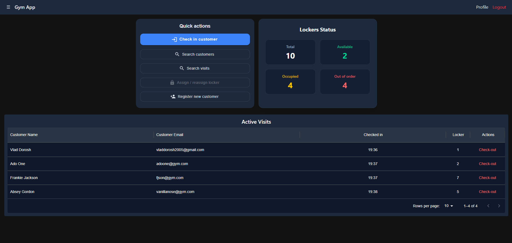
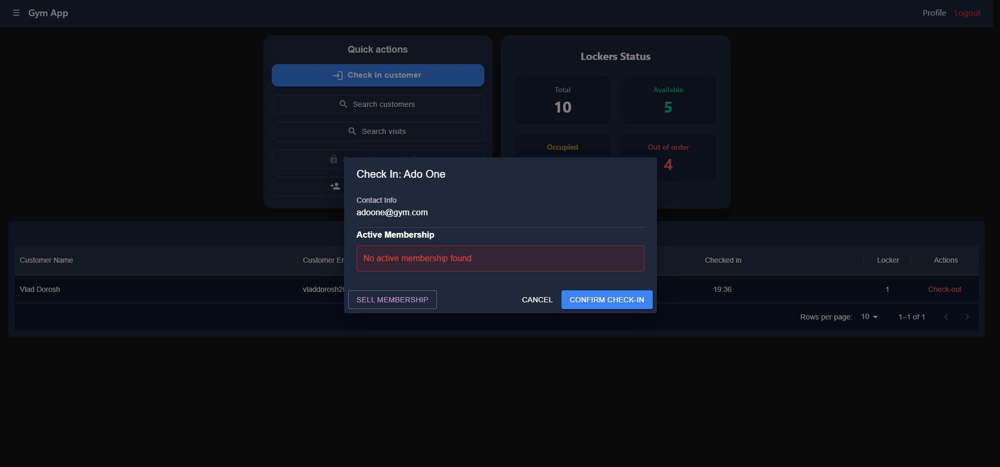
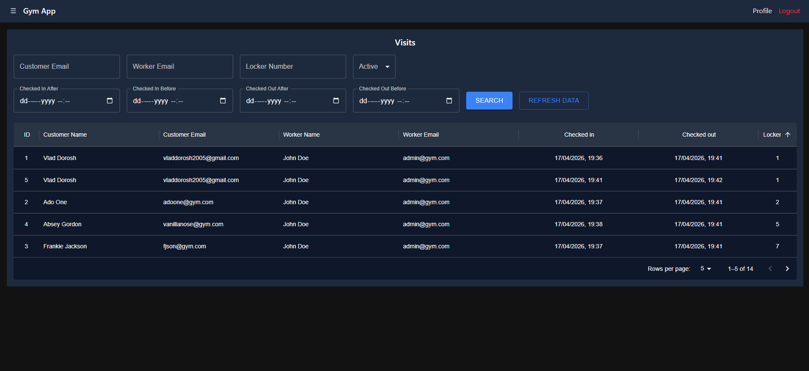
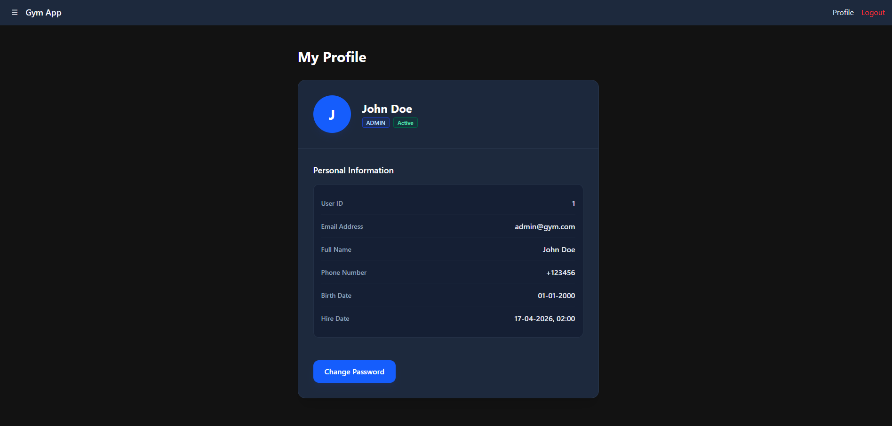

# Gym Management Frontend

A modern React frontend application for managing daily gym operations via connected Spring Boot REST API.

Built as the user interface for staff and reception workflows, including customer management, memberships, check-ins, lockers, and operational search tools.

Designed with a strong focus on responsive UI, clean component structure, maintainability, and efficient API integration.

---

## Tech Stack

- **Framework:** React 19
- **Language:** TypeScript
- **Build Tool:** Vite
- **Routing:** React Router
- **HTTP Client:** Axios
- **UI Library:** Material UI (MUI)
- **Styling:** Tailwind CSS
- **Authentication:** JWT
- **Notifications:** React Hot Toast
- **Containerization:** Docker

---


## Project Goals

This project was built to demonstrate practical frontend engineering skills:
- React + TypeScript development
- REST API integration
- Protected route architecture
- Data table handling
- Reusable components and maintainable structure
- Real-world admin dashboard workflows
- Responsive design and user experience considerations

---

## Key Features

### Authentication & Security
- Login flow integrated with JWT-based backend authentication.
- Automatic token handling for protected API requests.
- Session-aware route protection.

### Customer & Membership Management
- Register new customers.
- View customer profiles and active memberships.
- Purchase and activate memberships.
- Track membership status.

### Check-In Operations
- Fast customer check-in workflow for reception staff.
- Membership validation through backend API.
- Real-time feedback for successful or rejected check-ins.

### Locker Management
- Assign lockers to active visits.
- Replace unavailable lockers.
- Manage locker statuses such as available or out of order.

### Search & Data Management
- Search operational records using filters.
- Paginated data tables for scalable browsing.
- Visit history and administrative overviews.

### UI & User Experience
- Responsive modern interface.
- Toast notifications for user actions.
- Reusable components and maintainable structure.

---

## Example screenshots

### Dashboard

### Check-In Dialog

### Search Page with Filters and Results

### Staff Profile

---

## Architecture

Structured using a modular and scalable frontend architecture:

- **api/** – Centralized HTTP client configuration and REST API communication.
- **components/** – Shared reusable UI components used across the application.
- **context/** – Global React context providers such as authentication state.
- **features/** – Domain-based feature modules containing isolated components and logic.
- **layouts/** – Shared page layouts used throughout the app.
- **pages/** – Orchestrating pages/screens.
- **types/** – Shared TypeScript interfaces and types.
- **App.tsx** – Root application routing and composition.

---

## Backend Integration

This frontend consumes the Gym Management Backend API built with Spring Boot.
Detailed description of the API can be found in the [README.md file in this repository](https://github.com/floatyserve/gym_app_backend/blob/master/README.md).

---

## Installation

### Requirements

- Node.js 20+
- npm

### Setup

1. Clone repository
2. Run the following commands:
    ```bash
    git clone <repository-url>
    cd <project-folder>
    npm install
    npm run dev
    ```
3. Open http://localhost:5173 in your browser.

### Alternative Setup (Docker)
1. Ensure Docker is installed and running.
2. Run the following command in the project root:
    ```bash
    docker-compose up --build
    ```
3. Open http://localhost:5173 in your browser.
